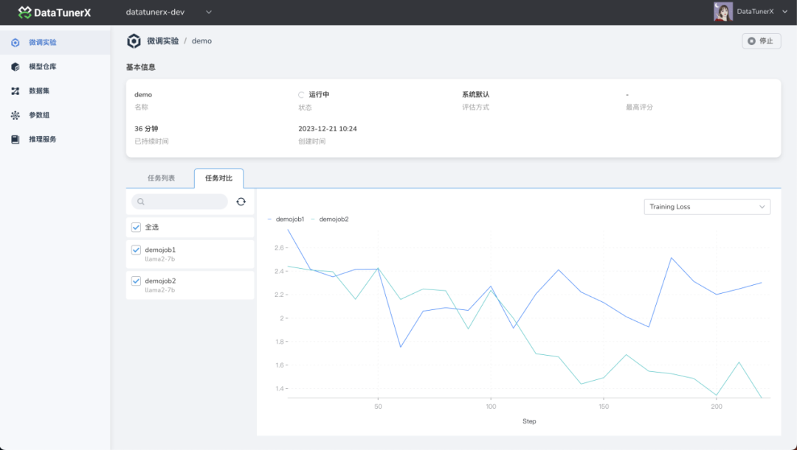

## DataTunerX 全面部署指南

本指南提供了在在线和离线环境中部署 DataTunerX 的详细说明。在进行部署之前，请确保满足以下所有前提条件。

### 前提条件

开始之前，请确保您的系统符合以下要求：

- **Kubernetes v1.19+**: 容器编排系统，用于自动化软件部署、扩展和管理。
- **Minio** 或其他兼容 S3 的对象存储：用于存储大型数据集和模型。
- **Harbor**  或其他容器镜像注册表： 用于安全地存储和管理容器镜像。
- **Helm**:  Kubernetes 应用程序的包管理器，用于部署和管理应用程序。

### 部署工件

所需工件：

- `dtx-ctl` DataTunerX 部署工具。
- `images-ai.tar`: 可选的 llm 离线镜像包（图像大小为 47.1GB）。
- `images.tar`: 可选的业务组件离线镜像包。

### 在线部署

#### 1. 下载 `dtx-ctl` 工具

```bash
wget https://github.com/DataTunerX/dtx-ctl/releases/download/v0.1.0/dtx-ctl.tar.gz
```

#### 2. 部署 DataTunerX

使用默认设置部署：

```bash
dtx-ctl install
```

或者，使用自定义设置部署：


```bash
dtx-ctl install <name> -n <namespace> --set [Your-Custom-Settings]
```

或者，使用配置文件部署：


```bash
dtx-ctl install <name> -f /path/to/your/config.yaml
```

### 离线部署


按照在线部署步骤下载 `dtx-ctl` 工具和基础镜像。另外，按照以下步骤处理业务组件镜像：

#### 1. 下载  `dtx-ctl` 工具

```bash
wget https://github.com/DataTunerX/dtx-ctl/releases/download/v0.1.0/dtx-ctl.tar.gz
```

#### 2. 下载基础镜像

```bash
# Placeholder for the actual command to download the base AI images, currently the link is valid for 24 hours, if you need to apply for the download package please mention issuer
wget https://public-download.daocloud.io/datatunerx/v0.1.0/images?e=1708664238&token=MHV7x1flrG19kzrdBNfPPO7JpBjTr__AMGzOtlq1:sZrIxT02pubO4BhPunS3sky3Fss=
```

#### 3. 下载基础 AI 镜像

```bash
# Placeholder for the actual command to download the base AI images, currently the link is valid for 24 hours, if you need to apply for the download package please mention issuer
wget https://public-download.daocloud.io/datatunerx/v0.1.0/images-ai?e=1708594433&token=MHV7x1flrG19kzrdBNfPPO7JpBjTr__AMGzOtlq1:DySesLobN0I7NeCBcYuZ74P8osA=
```

#### 4. 解压并导入业务镜像包

```bash
tar -zxcf images.tar -C /path/to/unzip
cd /path/to/unzip/images
```

对于 Docker:

```bash
docker load -i /path/to/image.tar
```

对于 Containerd:

```bash
ctr -n k8s.io images import /path/to/image.tar
```

#### 5. 修改镜像标签并推送到您的镜像仓库

```bash
docker tag source_image:tag target_repository/target_image:tag
docker push target_repository/target_image:tag
```

#### 6. 部署 DataTunerX

使用自定义设置配置您的镜像仓库部署：

```bash
dtx-ctl install <name> -n <namespace> --registry=your_registry --repository=your_repository
```

或者，使用配置文件：


```bash
dtx-ctl install <name> -f /path/to/your/config.yaml
```

### 命令行命令列表

与 `dtx-ctl`交互的命令，包括安装和管理的标志和子命令：

```bash
# 一般用法
dtx-ctl [command]

# 可用命令
completion  为指定的 shell 生成自动完成脚本
help        获取有关任何命令的帮助
install     在 Kubernetes 上安装 DataTunerX
uninstall   从 Kubernetes 中卸载 DataTunerX

# 安装标志
--chart-directory string     Helm 图表目录
--dry-run                    模拟安装
--image-file-dir string      指定镜像文件目录
--image-pull-policy string   镜像拉取策略
--image-pull-secret string   镜像拉取密钥
--registry string            容器注册表
--repository string          容器仓库
--set stringArray            设置 Helm 值
--set-file stringArray       从文件设置 Helm 值
--set-string stringArray     设置 Helm 字符串值
-f, --values strings         在 YAML 文件中指定 Helm 值
--version string             图表版本
--wait                       等待安装完成
--wait-duration duration     最长等待资源准备就绪的时间
```

请根据需要替换占位符和实际值以及下载链接。

----

# 页面展示

**数据集：**
支持本地文件和远程文件地址的方式定义大语言模型微调需要的数据集。
<div align="center">
  
</div>

**参数组：**
支持预先定义超参的组合定义，以及提供以模版的方式服用参数组的能力。
<div align="center">
  
</div>

**微调实验：**
支持多任务并发微调的能力，在多卡环境下，充分利用算力资源，一次微调出多个模型出来。
<div align="center">
  
</div>


**微调对比：**
在微调过程中，对比不同任务之间的 metrics 数据，以此来分析不同任务的表现。
<div align="center">
  
</div>

**微调日志：**
查看在微调过程中，微调任务的实时的训练过程的日志，帮助分析微调的运行过程。
<div align="center">
  
</div>

**模型仓库：**
<div align="center">
  
</div>


**推理对比：**
在微调实验中会进行评估，在微调出来之后，还可以进行部署推理服务，针对这些来源于不同微调模型部署出来的推理服务，进行推理对比，使用相同的输入，观察不同微调模型的推理效果，来分析微调出来的模型的表现。
<div align="center">
  
</div>

----
# CRD 展示

从使用的角度介绍一下关键的 CRD 的使用案例：

## 数据集定义

```bash
apiVersion: extension.datatunerx.io/v1beta1
kind: Dataset
metadata:
  name: example-dataset-liantiao
  namespace: datatunerx-dev
spec:
  datasetCard:
    datasetCardRef: configmap-dataset-readme
  datasetFiles:
    source: ""
  datasetMetadata:
    datasetInfo:
      features:
      - dataType: string
        mapTo: instruction
        name: instruction
      - dataType: string
        mapTo: output
        name: response
      subsets:
      - name: default
        splits:
          test:
            file: s3://datatunerx/xxx1
          train:
            file: s3://datatunerx/xxx2
          validate:
            file: s3://datatunerx/xxx3
    languages:
    - zh-CN
    license: CC BY-NC
    plugin:
      loadPlugin: true
      name: dataplugin-sample
      parameters: '{"Train":"s3://datatunerx/xxx2,"Test":"s3://datatunerx/xxx1,"Validate":"s3://datatunerx/xxxx3","SubsetName":"default"}'
    size: n < 1K
    tags: []
    task:
      name: Text Generation
      subTasks: []
```
## 大模型
```bash
apiVersion: core.datatunerx.io/v1beta1
kind: LLM
metadata:
  name: llama2-7b
  namespace: datatunerx-dev
spec:
  llmMetdata:
    computeInfrastructure:
      hardware:
        cpu: 4
        memory: 28Gi
        vRam: 6Gi
    domain:
    - NLP
    frameworks:
    - PyTorch
    languages:
    - English
    license:
    - https://ai.meta.com/resources/models-and-libraries/llama-downloads/
    llmImageConfig:
      image: harobor.custome.com/llama2-7b:v1
      path: /data/llama2-7b
    name: Llama-2-7b
    tasks:
    - Text Generation
```

## 参数组定义
```bash
apiVersion: core.datatunerx.io/v1beta1
kind: Hyperparameter
metadata:
  name: happu
  namespace: datatunerx-dev
spec:
  objective:
    type: SFT
  parameters:
    FP16: false
    PEFT: true
    batchSize: 32
    blockSize: 512
    epochs: 10123156464
    gradAccSteps: 1
    int4: false
    int8: false
    learningRate: "0.001"
    loRA_Alpha: "32.0"
    loRA_Dropout: "0.1"
    loRA_R: "4"
    optimizer: AdamW
    scheduler: Cosine
    trainerType: Standard
    warmupRatio: "0.1"
    weightDecay: "0.0001"
```

## 微调实验定义
```bash
apiVersion: finetune.datatunerx.io/v1beta1
kind: FinetuneExperiment
metadata:
  name: test
  namespace: datatunerx-dev
spec:
  finetuneJobs:
  - name: test
    spec:
      finetune:
        finetuneSpec:
          dataset: example-dataset-liantiao
          hyperparameter:
            hyperparameterRef: happu
            overrides:
              batchSize: 1
              blockSize: 10
              epochs: 1
          image:
            imagePullPolicy: IfNotPresent
          llm: llama2-7b
          resource:
            limits:
              cpu: "2"
              gpu: "1"
              memory: 4Gi
            requests:
              cpu: "2"
              gpu: "1"
              memory: 4Gi
      scoringConfig:
        name: BuildInScoringPlugin
        parameters: '{}'
      serveConfig:
        nodeSelector:
          nvidia.com/gpu: present
  scoringConfig:
    name: BuildInScoringPlugin
    parameters: '{}'
  serveConfig:
    nodeSelector:
      nvidia.com/gpu: present
```
