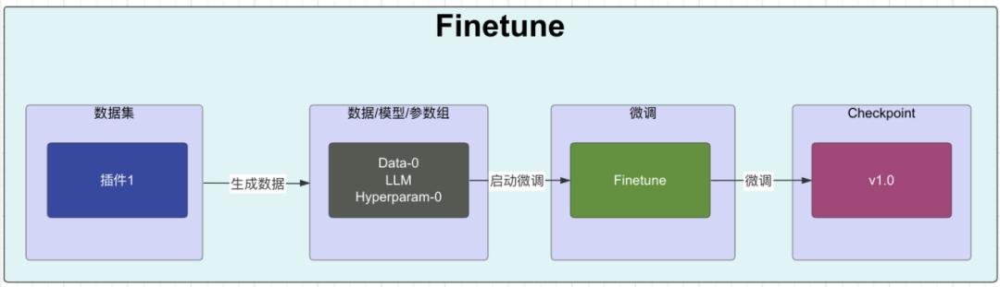
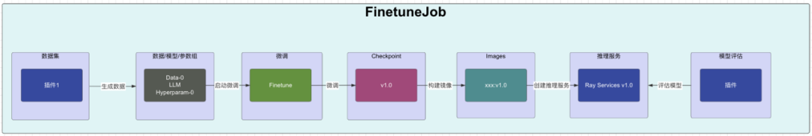
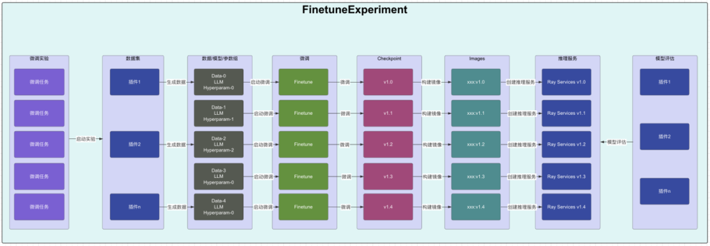
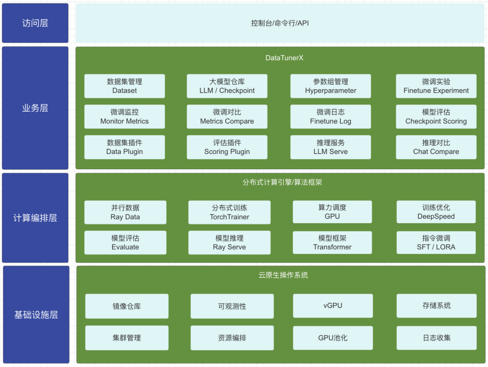
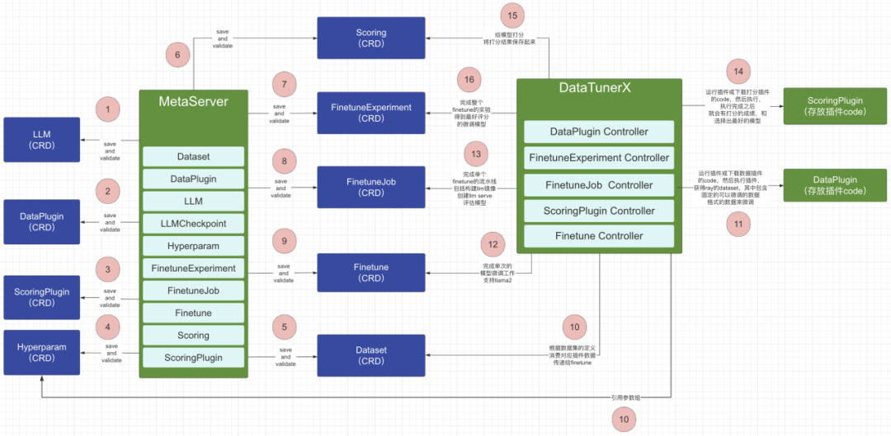
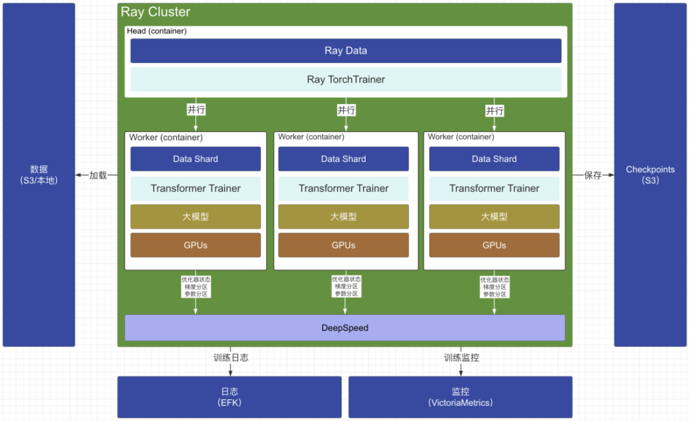

# Welcome 👋
# 概述 📋
***DataTunerX (DTX)*** 被设计为与分布式计算框架集成的云原生解决方案。利用可扩展的 *GPU* 资源, i是一个专注于高效微调 *LLMs*的平台，重点放在实用性上。 其核心优势在于促进批量微调任务，使用户能够在单个***实验***中同时进行多个任务。 ***DTX*** 包含了 ***数据集管理***、***超参数控制***、***微调工作流***、***模型管理***、***模型评估***、***模型比较推断*** 和 ***模块化插件系统*** 等基本功能。

**状态**:  

*v0.1.0* - 早期开发阶段。 请查看[CHANGELOG](CHANGELOG.md) 以获取最近更新的详细信息。

**操作演示视频**:  

      

[//]: # (**Screenshot**:)

[//]: # ()
[//]: # (![**DTX Screenshot**]&#40;https://raw.githubusercontent.com/DataTunerX/datatunerx-controller/main/assets/screenshot/Job_Details.png&#41;)

# 相关术语 💬
**DataTunerX:**

这个是项目的名称，顾名思义就是数据的处理能力，模型的微调能力为核心能力的项目。该项目由 DaoCloud 和 Futurewei 联合发起并研发，项目地址为：https://github.com/DataTunerX/datatunerx。它是大模型和云原生完美结合的方案。

**云原生（Cloud Native）：**

基于 Kubernetes 的 CRD 和 Operator 设计和开发的，一套围绕大语言模型、数据处理、大语言模型微调、评估、并行等能力的开源解决方案。让大模型的微调能力变成云原生应用的能力。

**数据集（Dataset）：**

与大语言模型微调中的数据集定义基本差不多，这里主要提到的是训练集（用于大语言模型微调的主要微调数据，也就是想让大语言模型能够学会的数据），验证集（在微调过程中用于验证大语言模型微调效果的数据），测试集（用于在大语言模型这次微调结束之后，用于验证本地微调的效果的数据）。

**基础大语言模型（Base Large Language Model）：**

大语言模型（LLM）是指使用大量文本数据训练的深度学习模型，是一种用于自然语言处理的深度学习模型，它通过大规模的预训练来学习自然语言的表示和语言模式。这些模型可以用于各种任务，如文本生成、文本分类、机器翻译等，以生成或处理自然语言文本。基础大语言模型就是微调过程中，被微调的底座的大语言模型。

**参数组（Hyperparameter Group）：**

代表一组超参的集合。在大语言模型的微调过程中，可以根据需要设置很多不同的超参，如 Scheduler、Optimizer、LearningRate、Epochs、BlockSize、BatchSize 等，这里的参数组就是各种超参的组合。
评估（Scoring / Evaluation）：用于对大语言模型进行评定好与不好的一种方式。还有一种专业点的说法叫 metrics。评估中支持很多种不同的 metric 类型，如 Bleu、Accuracy、Precision、Recall、Rouge、F1 等，不同类型的大模型任务需要使用不同的 metric 算法进行评估。评估的时候也需要特定格式的数据来进行评估。

**微调实验（FinetuneExperiment）：**

实验，顾名思义就是要做一次尝试。可以使用数据集、大语言模型、参数组进行不同的组合进行实验，指定本次实验的评估方式，每个组合就是一个微调任务。最终根据这次实验的所有组合进行微调之后，给每个微调任务进行打分，评估出这次实验微调出来最好的模型。在这个过程中是并行地使用所有可以使用的算力，我们知道大语言模型的微调是存在随机性，在这个背景下，卡越多，每次实验并行数越多，每次实验结束，出现优秀模型的概率就越大。这是用算力资源换取时间的方式，来提升整体的微调效率。下次微调就可以基于上次评估出来最好的模型进行再次微调。

**微调任务（FinetuneJob）：**

一次微调任务就是使用指定的数据集、指定的大语言模型、指定的参数组、指定的评估方式，进行微调的运行，运行结束就会产生一个微调版本的大语言模型，并且得到对这次微调出来的模型的评分。

**微调（Finetune）：**

使用指定的数据集、指定的大语言模型、指定的参数组进行真正的微调工作，包含了具体的微调工作的实现，在微调过程中会有相关的微调的日志、监控数据、微调出来的权重文件等。

**数据插件（DataPlugin）：**

数据是大语言模型的基石。微调需要的数据是多种多样的，所以处理数据的能力也无法统一标准化，这种情况下，满足数据处理的多样化能力就需要系统有插件化的能力，提供可以根据不同的数据进行不同处理的能力。

**评估插件（ScoringPlugin）：**

不同类型的模型评估方式可能是不同的，不同的场景评估方式也可能是不同的，这个时候无法内置一种万能的评估能力，所以需要开放评估能力，以插件的方式实现这种能力。

**模型仓库（LLM / LLMCheckpoint）：**

不管是基础大模型，或者是微调出来的模型，在这里它都是一个模型，这里的模型仓库就是存放模型的地方，可以是基础大模型（LLM），也可以是微调出来的模型（LLMCheckpoint），基于这些模型可以进行后续的推理服务的部署或者对比等。

# 主要功能 💪
***DTX*** 为用户提供了一组强大的功能，旨在有效地微调大型语言模型。深入了解使 ***DTX*** 成为多功能平台的功能：

**1.数据集管理：**

支持通过 *S3* 协议（ *http* 即将到来）和本地数据集上传，轻松管理数据集。数据集按照测试、验证和训练等划分进行组织。此外，特征映射提高了微调任务的灵活性。

  

**2. 微调实验：**

通过创建多个微调作业来进行微调实验。每个作业可以使用不同的LLM、数据集和超参数。通过实验的评估单元统一评估微调模型，以识别微调结果。

  
  
  

**3. 作业洞察：**

深入了解实验中每个微调作业的详细信息。探索作业详情、日志和度量可视化，包括学习率趋势、训练损失等。

**4. 模型仓库：**

将LLM存储在模型仓库中，便于高效管理和部署推理服务。

  

**5. 超参数组管理：**

利用丰富的参数配置系统，支持多样化的参数和基于模板的区分。

**6. 推理服务：**

同时部署多个模型的推理服务，实现简单直观地比较和选择性能最佳的模型。

**7. 插件系统：**

利用插件系统为数据集和评估单元提供支持，使用户能够集成专门的数据集和评估方法，以满足其独特需求。

**8. 更多(Coming Soon)️：**

***DTX*** 提供了一套全面的工具，确保您在微调过程中拥有灵活性和强大功能。根据您的特定需求去探索每个特征定制您的微调任务。

# 关键特点 ✨
**一站式自动化：**
全流程通过可视化管理界面的方式展示大模型微调中涉及到的数据管理、超参优化、微调任务、模型评估及推理验证。

**并行微调流水线：**
支持配置不同的数据集、参数组、基础大语言模型混合组合的方式构建大语言模型的微调流水线，并行执行微调实验并自动化评估微调效果。

**推理对比：**
支持基于微调出来的大语言模型部署推理服务，并对选择需要对比的推理服务使用相同的问题进行对比，以此来分析模型的表现。

**灵活可扩展：**
支持使用插件的方式扩展数据的处理能力，同时也支持使用插件的方式扩展评估的处理方式。

**分布式训练：**
提供灵活扩展的分布式训练能力，可以灵活应对单机单卡，单机多卡，多机多卡的模型微调。基于 Ray、KubeRay、DeepSpeed 等技术实现分布式训练/微调的能力。

**可扩展架构：**
使用云原生的技术，为大模型微调提供统一的、可弹性扩展的 GPU 能力和其它资源的能力。

**云原生能力：**
云原生方式构建了大模型的微调能力。标准、高效的算力资源调度和管理能力。

# 核心思路 💡

**Finetune:**
这里的微调专注于基于数据、大模型、参数组进行大模型微调的核心业务处理能力。只关注微调本身，最后的输出就是 checkpoint。是一个很典型的微调的流程。微调过程中的状态也会记录在资源对象的状态中。

  

**FinetuneJob：**
这里的微调任务，不仅仅有上面的微调的能力，还会基于云原生的方式构建对应的镜像，以及启动对应微调出来的大模型的推理服务，并基于推理服务来完成本次的微调模型的模型评估能力，最后还会保存评估结果。FinetuneJob 中会包含 Finetune 的能力。FinetuneJob 在运行过程中的状态也会记录在资源对象的状态中，同时还会同步 Finetune 的状态到 FinetuneJob 中的状态中。

  

**FinetuneExperiment：**
因为大模型微调存在的不确定性，所以在资源充分的情况下，并行微调就变得很多必要。这里的微调实验就是利用数据、大模型、参数组这三个配置灵活组合，利用底层的多个 GPU 的卡，一次操作，并行完成多次微调，然后基于所有微调模型进行总体的评估，最后在这次实验中，使用相同的评估标准，找出最佳的微调模型作为本次微调实验的推荐的微调模型。FinetuneExperiment 中其实就是包含了多个 FinetuneJob。也是用户侧使用的入口。FinetuneExperiment 在运行过程中的状态也会记录在资源对象的状态中，同时还会同步 FinetuneJob 的状态到 FinetuneExperiment 中的状态中。

  

 
 

# 架构 🏛️

介绍架构设计展示DataTunerX 结构的概览。这包括关键组件的细节、它们的相互作用以及它们如何为系统的功能做出贡献。

  

**访问层：** 系统的访问能力，支持 UI 页面的方式，提供全量的系统能力；同时基于标准的 Kubernetes 的 rest api 的接口方式管理资源对象；提供了命令行的方式管理一些软件的管理能力，同时使用 kubectl 命令行可以完成全量的业务能力。

**微调层：** 基于 Kubernetes 的 CRD 和 Controller（Operator）的能力实现了一套大模型微调系统。主要包含的 CRD: LLM、LLMCheckpoint、Hyperparameter、Dataset、DataPlugin、Scoring、ScoringPlugin、FinetuneExperiment、FinetuneJob、Finetune。

**计算编排层：** 通过使用 Ray 的 data 能力为微调任务提供数据能力；通过 kuberay 的 rayjob 的能力跑微调的训练任务；通过 rayservice 的能力提供微调模型的推理服务，用于微调模型的评估。

**基础设施层：** 通过云原生操作系统提供容器的能力、编排能力、存储的能力、网络的能力、GPU 的算力能力。同时为 kuberay 和 Operator 提供运行时。

# 关键技术 📡

***DTX*** 基于云原生原则构建，采用了包含不同 *自定义资源定义（CRD）* 和 *控制器* 逻辑的各种[*Operators*](https://www.redhat.com/en/topics/containers/what-is-a-kubernetes-operator)。主要使用 *Go* 语言开发，使用[*operator-sdk*](https://github.com/operator-framework/operator-sdk)工具包实现。在Kubernetes（K8s）环境中运行，***DTX***依赖于Operator模式来进行 *CRD* 的开发和管理。此外，***DTX*** 还与[*kuberay*](https://github.com/ray-project/kuberay)集成，以利用分布式执行和推断功能。

## 云原生相关

  

**meta-server：**
在 1-9 中，主要体现的是 meta-server 用于持久化数据结构的能力，包括增删改查。由于使用的 Kubernetes 的 crd 的技术，所以这里的数据最终保存的位置是 Kubernetes 集群的 etcd 中。这里的 meta-server 负责定义和维护 datatunerx 整个系统中所有的数据结构。组件的角色类似于 Kubernetes 中的 api server。

**datatunerx：**
这个是业务能力的核心组件，其中包含了 5 个核心的 Kubernetes 的 controller。组件的角色类似于 Kubernetes 中的 controller manager。每一个 controller 负责不同的能力，最终构建完整的业务能力。FinetuneExperiment Controller 是整个业务能力关键入口，负责处理 FinetuneExperiment（微调实验）的资源对象，这里的一个 FinetuneExperiment 可以包含多个 FinetuneJob，一次微调实验可以完成多个不同配置的微调任务。接下来，由 FinetuneExperiment Controller 派生出 FinetuneJob（微调任务）资源对象，FinetuneJob 由 FinetuneJob Controller 来负责处理，每一个 FinetuneJob 资源对象代表着一次独立的微调任务，这其中也包含了对微调出来的微调模的评估等。之后再由 FinetuneJob Controller 派生出 Finetune（微调）资源对象，Finetune 资源对象由 Finetune Controller 来处理，这里的 Finetune 也是整个系统核心的微调逻辑的业务处理部分，重点就关注怎么基于数据集、参数组、基础大模型进行大模型的微调。

**scoring plugin：**
在对模型评估的时候，不同的任务类型对评估的方案会不同，这里提供了一种扩展的插件方式，支持新增自定义的评估的方式，在创建微调实验的时候可以选择自定义的插件。系统默认也自带了评估的能力。

**data plugin：**
数据是大模型很关键的来源，不同的任务类型对数据的格式要求都会不同，所以对数据的预处理就变得很有必要，这里提供了一种扩展的插件方式，支持新增自定义数据处理的方式，以满足不同的场景需求。

## 大模型微调相关

  

**数据：**
指的就是用于微调的数据，可以包括训练集、评估集、测试集。支持从本地 upload 数据集，也支持保存在 S3 协议的对象存储中的远程数据集文件。

**Ray Cluster：**
这里使用的 Ray，其中在 Ray Cluster 的 head 节点中发起分布式的训练任务，其中使用了 ray data 和 ray train 的能力，ray data 负责从文件服务器（S3）上读取数据，将数据进行 data shard 化处理，由 ray train 的 TorchTrainer 完成分布式训练的能力封装。真正的微调的业务能力由每一个 worker 中的 transformers 的 trainer 来完成。因为 TorchTrainer 的实现中要求在每一个 worker 中执行的 trainer 是需要实现 transformers 的 trainer 接口。每一个 worker 都会被分配一个 data shard，绑定上 GPU 算力资源，使用 transformers 的 trainer 来完成训练或者微调等工作，目前主要结合在 trainer 中使用 data shard，基础大模型，deepspeed，lora 等相关技术完成基于数据并行的大模型微调能力，目前主要微调的模型支持的范围还是以小模型为主，一般单卡的显存都是可以完成的。

**日志：**
在训练的过程中，训练任务的日志对于观察训练过程是非常重要的分析手段，这里运行的方式是容器化的方式，所以原生支持 Kubernetes 中实时日志和离线日志的持久化方式，根据需要是不是要对训练的日志进行保留一段时间。目前支持以容器的标准控制台的 log，结合 EFK 等日志方案，持久化微调日志。

**监控：**
在训练过程中，metrics 的观察也是非常重要的手段，包括查看当前的 training loss 、 learning rate、validation loss、performance evaluation 等数据，来确定微调的结果走向是不是预期的效果。而这些数据也是可以进行持久化的，目前支持导出到 VictoriaMetrics 中，VictoriaMetrics 也是云原生使用很大的时序数据库。

**Checkpoint：**
指的是微调出来的微调模型，在微调之后会保存一份在 S3 存储中。这部分是以文件形式存储的。在整个业务流程中，Checkpoint 会被构建成容器镜像，提供模型评估和推理服务能力。

# Known issues 🚨

Document any known significant shortcomings with the software.

# Getting help ❓

If you have questions, concerns, or bug reports, please file an issue in this repository's [*Issue Tracker*](https://github.com/DataTunerX/datatunerx-controller/issues).

# Getting involved 🤝

We welcome contributions! Check out our [*CONTRIBUTING*](CONTRIBUTING.md) guidelines to get started. Share your feedback, report bugs, or contribute to ongoing discussions.

----

# Credits and References 🙌

1. **Kubernetes (k8s):** 
   - [*Kubernetes*](https://kubernetes.io/): An open-source container orchestration platform for automating the deployment, scaling, and management of containerized applications.

2. **Ray:**
   - [*Ray Project*](https://ray.io/): An open-source distributed computing framework that makes it easy to scale and parallelize applications.

3. **KubeRay:**
   - [*KubeRay*](https://github.com/kuberay/kuberay): An integration of Ray with Kubernetes, enabling efficient distributed computing on Kubernetes clusters.

4. **Operator SDK:**
   - [*Operator SDK*](https://sdk.operatorframework.io/): A toolkit for building Kubernetes Operators, which are applications that automate the management of custom resources in a Kubernetes cluster.

5. **LLaMA-Factory:**
   - [*LLaMA-Factory*](https://github.com/hiyouga/LLaMA-Factory): An easy-to-use llm fine-tuning framework.

Feel free to explore these projects to deepen your understanding of the technologies and concepts that may have influenced or inspired this project.
